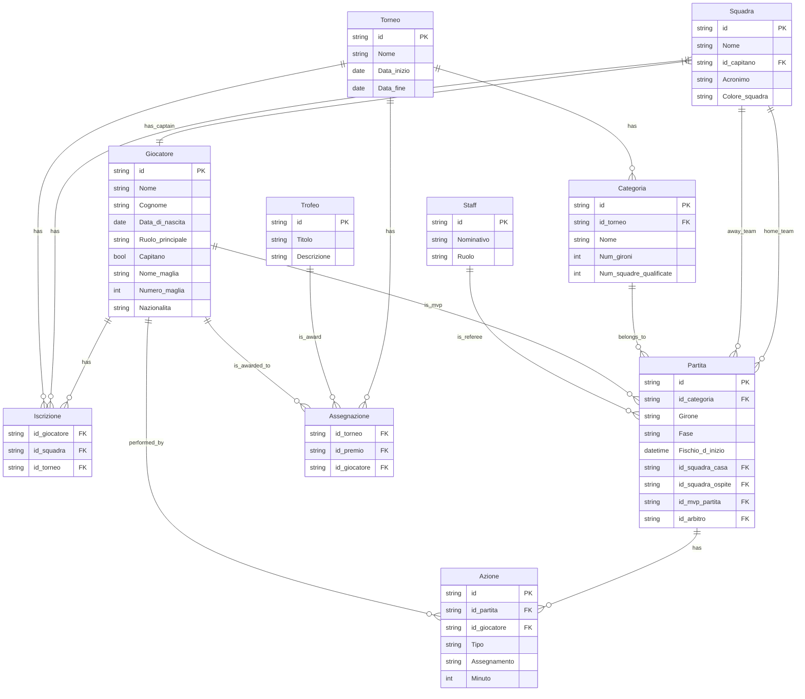

# Torneo Città di Trento - Official Website

This is the official website for the "Torneo Città di Trento" football tournament. This project is a modern web application built to provide information about the tournament, including teams, players, matches, and statistics.

All of the following info is related to version 1.0, which was last updated on the 21 of May, 2026.

## About The Project

For over thirty years, the Torneo Città di Trento has been one of the most recognized and participated amateur football events in the Trentino area. This project was born out of the need to centralize information, improve the user experience, provide statistics and historical data, and offer a modern and easily accessible platform for the tournament.

The goal is to create a digital ecosystem that is simple to use, updatable in real-time, and easily expandable for future editions of the tournament.

## Features

The website includes the following features:

-   View main and summary information from the homepage.
-   View rankings from various tournament editions.
-   Search and filter current and past matches.
-   Search and filter current and past teams.
-   Search and filter current and past players.

## Pages

The main pages of the application are:

-   **Homepage**: Main landing page with an overview of the tournament, recent results, upcoming matches, and key statistics.
-   **Matches List**: A calendar view of all matches for a specific edition.
-   **Match Info**: Detailed information for a specific match, including scorers, assists, and cards.
-   **Teams List**: A grid of all teams, searchable and filterable by edition and other criteria.
-   **Team Info**: Detailed statistics and information about a specific team, including player roster and match history.
-   **Players List**: A searchable grid of all registered players.
-   **Player Info**: Detailed statistics and information for a specific player, including trophies and match history.

## Tech Stack

This project is built with a modern technology stack:

*   **Framework:** [Next.js](https://nextjs.org/) (with App Router)
*   **Language:** [TypeScript](https://www.typescriptlang.org/)
*   **Backend & Database:** [Supabase](https://supabase.io/)
*   **UI Components:** [ShadCN/UI](https://ui.shadcn.com/)
*   **Styling:** [Tailwind CSS](https://tailwindcss.com/)
*   **Data Visualization:** [Recharts](https://recharts.org/)
*   **Deployment:** [Vercel](https://vercel.com/)

## Data Structure

The database schema is designed to be flexible and scalable. Here is a visualization of the main tables, their main properties and relationships:



## Getting Started

To get a local copy up and running, follow these simple steps.

### Prerequisites

Make sure you have Node.js and npm (or yarn/pnpm) installed on your machine.

### Installation

1.  Clone the repo
    ```sh
    git clone https://github.com/amarsdk03/sito-web-tct.git
    ```
2.  Install NPM packages
    ```sh
    npm install
    ```
3.  Set up your Supabase environment variables in a `.env.local` file. You'll need your Supabase URL and anon key.
    ```
    NEXT_PUBLIC_SUPABASE_URL=your_supabase_url
    NEXT_PUBLIC_SUPABASE_ANON_KEY=your_supabase_anon_key
    ```

### Running the Application

To run the development server:

```sh
npm run dev
```

Open [http://localhost:3000](http://localhost:3000) with your browser to see the result.

## Folder Structure

The project follows a structure that separates concerns and makes it easy to navigate:

-   `src/app/`: Contains the pages and routes of the application, following the Next.js App Router structure.
-   `src/components/`: Shared React components used across the application (e.g., Navbar, Footer, UI elements).
-   `src/const/`: Constant data used throughout the application, like sponsor lists or staff information.
-   `src/features/`: Contains code related to specific application features.
-   `src/lib/`: Utility functions, Supabase client setup, and other helper modules.
-   `src/types/`: TypeScript type definitions, including generated types from the Supabase database schema.
-   `public/`: Static assets like images, fonts, and icons.
-   `supabase/`: Supabase local development setup, including database migrations.

## Questions?

If you have any questions, suggestions, or simply want to let me know anything, feel free to send an email to amarsdk03@gmail.com
